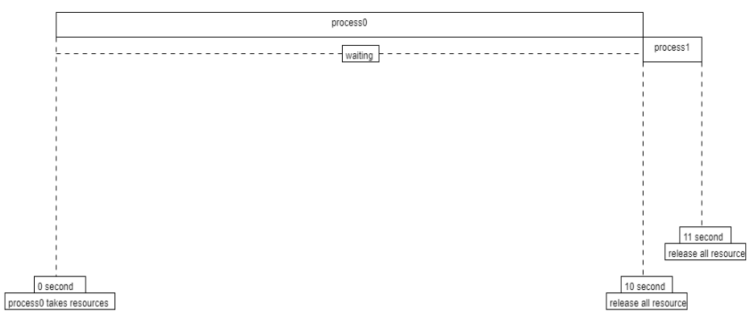
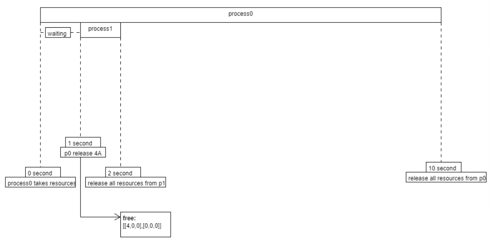

# Modified Banker's Algorithm with Dynamic Resource Release

This repository contains a proof-of-concept implementation of a modified Banker's Algorithm, designed to dynamically release resources during the execution of processes. The modification is inspired by the paper titled **"Modified Banker's Algorithm with Dynamically Released Resources"** presented at the 2021 International Conference on Communications, Information System, and Computer Engineering (CISCE).

## Overview

The Banker's Algorithm is a classic resource allocation and deadlock avoidance algorithm that tests for the safe state of processes in a system. This modified version introduces a mechanism where resources are released dynamically during the execution of processes rather than at the end, which can lead to more efficient resource utilization.

### Original Banker's Algorithm

In the original Banker's Algorithm:
- Each process runs to completion before releasing any of its allocated resources.
- Resources are checked at the beginning to ensure that the system remains in a safe state throughout the process execution.



### Modified Banker's Algorithm

In the modified version:
- Processes can release a portion of their allocated resources as they proceed, making them available for other processes earlier.
- This dynamic release is demonstrated in `process0`, where 4 units of resource `A` are released midway through its execution.



#### Visualization of `process0` in Modified Algorithm

The following image illustrates how `process0` behaves in the modified algorithm, releasing resources dynamically during its execution:

.png)

## Files in this Repository

- **`README.md`**: This file.
- **`modified_bankers_algorithm.py`**: The implementation of the modified Banker's Algorithm.
- **`original_bankers_algorithm.py`**: The implementation of the original Banker's Algorithm for reference.

## How to Run

### Prerequisites
- Python 3.x installed on your machine.

### Running the Modified Banker's Algorithm

To run the modified Banker's Algorithm:

```bash
python modified_bankers_algorithm.py
```

### Running the Original Banker's Algorithm

To run the original Banker's Algorithm:

```bash
python original_bankers_algorithm.py
```

## Expected Output

### Modified Banker's Algorithm
When running the modified version, you should observe that:

- Process 0 releases resources midway through its execution, making them available for Process 1 sooner.
- Both processes complete execution, and the total time is logged.

### Original Banker's Algorithm
When running the original version, you should observe that:

- Resources are only released after the process completes.
- Both processes complete execution, and the total time is logged.

### Sample Output (Modified Version)

```plaintext
maximum: 
[[4, 2, 2], [5, 2, 4]]
allocation: 
[[4, 1, 2], [4, 2, 4]]
total allocation: 
[8, 3, 6]
total resources: 
[5, 4, 5]
need: 
[[0, 1, 0], [1, 0, 0]]
available and work:
[0, 1, 0]
[0, 1, 0]
safe: 
[False, False]
Process 0 start
p0 releasing 4 A

work = [0, 1, 0]

Process 1 start

work = [4, 1, 0]

Process 1 finish
Process 0 finish

sequence: [0, 1]
total time: 10.009035110473633
```

### Sample Output (Original Version)

```plaintext
aximum: 
[[4, 2, 2], [5, 2, 4]]
allocation: 
[[4, 1, 2], [4, 2, 4]]
total allocation: 
[8, 3, 6]
total resources: 
[5, 4, 5]
need: 
[[0, 1, 0], [1, 0, 0]]
available and work:
[0, 1, 0][0, 1, 0]
safe: 
[False, False]
Process 0 start
Process 0 finish
Process 1 start
Process 1 finish
sequence: 
[0, 1]
total time: 11.018242597579956
```

### References
- Paper: Modified Banker's Algorithm with Dynamically Released Resources
- DOI:10.1109/CISCE52179.2021.9445935
- Conference: 2021 International Conference on Communications, Information System and Computer Engineering (CISCE).


